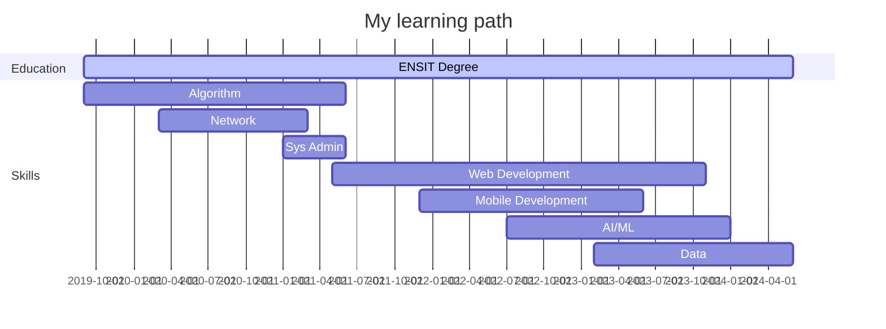

<div align="center">

### Hey  <br> I'm **Cyrille** !

<br>


[](https://git.io/typing-svg)

<p align="center">
  <a href="https://www.linkedin.com/in/cyrille-n-dah-172022225"></a>
  <a href="mailto:cyrillendah.23@gmail.com"></a>
  <a href="https://23cyy-eng.hashnode.dev"></a>
  <a href="https://gitlab.com/23.cy"></a>
  <a href="https://www.instagram.com/holyy.dev"></a>
  <a href="https://www.tiktok.com/@holyy.dev"></a>
  <a href="https://app.daily.dev/23cyy">
</a>
</p>

<div align="left">
  
```json
{
  "current_status": "🚧 Building awesome stuff",
  "hobbie": "🎮 Black Myth Wukong",
  "passion": "❤ Tech world",
  "mindset": "🧠 Growing daily"
}
```
  
</div>

</div>

<br>

###  About Me

I'm a Software Engineer, passionate about solving complex problems through innovative solutions. My journey is driven by constant curiosity and a desire for continuous learning in emerging technologies.

<details>
<summary><b>🌱 What I'm Passionate About</b></summary>
<br>
<ul>
  <li>🖥️ Software, Web & Mobile Development</li>
  <li>🎮 Game Development & 3D Modeling</li>
  <li>🔐 Cybersecurity & Networks</li>
  <li>📊 Data Science & Artificial Intelligence</li>
</ul>
</details>

<details>
<summary><b>🏆 Core Competencies</b></summary>
<br>
<ul>
  <li>🏗️ Software Architecture</li>
  <li>💻 Software & Web Development</li>
  <li>📈 Business Intelligence & Analytics</li>
  <li>🤖 Machine Learning</li>
  <li>🎨 UX/UI Design</li>
</ul>
</details>

<!-- Custom timeline -->
<details>
<summary>📅 Learning Timeline</summary>
<br>



</details>

<br>

###  Tech Stack
<div align="left">
<table>
  <tr>
    <td><b>💻 Languages</b></td>
    <td>
      
      
      
      
      
    </td>
  </tr>
  <tr>
    <td><b>🧰 Frameworks</b></td>
    <td>
      
      
      
      
      
    </td>
  </tr>
  <tr>
    <td><b>🗄️ Databases</b></td>
    <td>
      
      
      
      
    </td>
  </tr>
</table>
</div>

<br>

###  Featured Projects

> These projects are currently offline as I'm working on new ideas and updates. Links are temporarily disabled but kept here for reference.

<div align="left">

| Project | Description | Link |
|--------|-------------|------|
|  | Task Management | ~~[TODO List](https://todo-list-23cyy.netlify.app)~~ *(offline)* |
|  | Mystery Number Game | ~~[Mystery Number](https://find-mystery-number.netlify.app)~~ *(offline)* |
|  | Online Clock | ~~[Online Clock](https://online-clock.onrender.com)~~ *(offline)* |
|  | French Verb Conjugator | ~~[Conjugator](https://conjugueur-v2.onrender.com)~~ *(offline)* |
|  | ENSIT Website | ~~[ENSIT](https://ensit-site-test.onrender.com)~~ *(offline)* |


</div>

<br>

###  Development Analytics

<div align="center">
  
</div>

<div align="center">
  
|  |  |
|--------------------------------------------------------------------------------------------------------|--------------------------------------------------------------------------------------------------------------------|

</div>

<div align="center">
  
  <br>
  <br>

  [](https://github.com/23cyy)

</div>

<!-- Animated divider -->


<div align="left">
  
><!-- LAST_UPDATE_START -->
> Last update on **Tue Oct 21 2025**
><!-- LAST_UPDATE_END -->
><!-- COUNTDOWN_START -->
> **71** days before **2026** ⏱
><!-- COUNTDOWN_END -->
><!-- LEAP_YEAR_STATUS_START -->
> **This is not a leap year.**
><!-- LEAP_YEAR_STATUS_END -->
><!-- QUOTE_START -->
> **Quote of the day** : *Success is a state of mind.*
><!-- QUOTE_END -->

</div>
